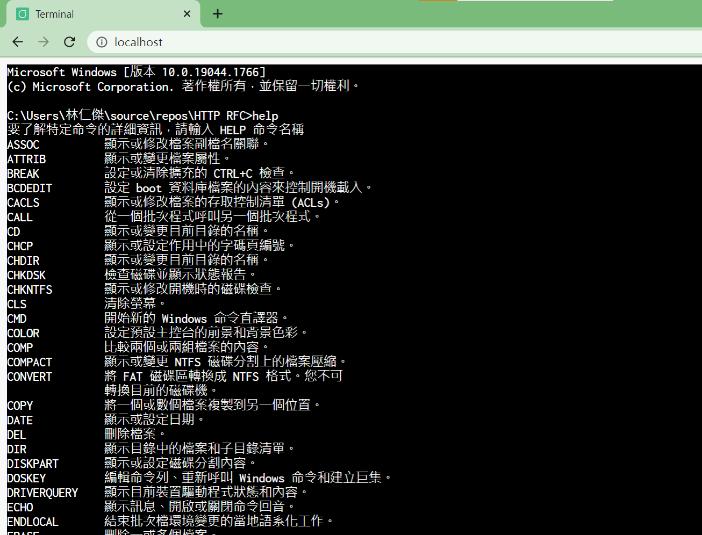
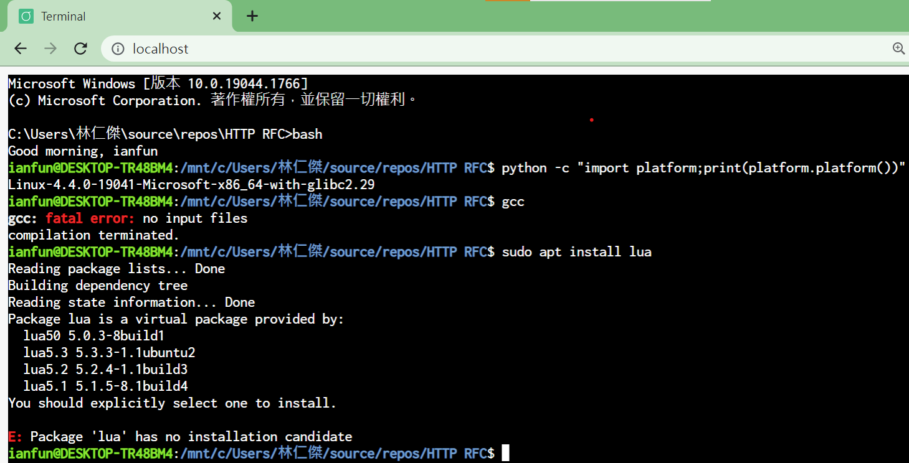

# Winsock-WebSocket-Server

WebSocket(version 13) and HTTP/1.1 file server using [Winsock2](https://docs.microsoft.com/en-us/windows/win32/winsock/windows-sockets-start-page-2), [Cryptography API](https://docs.microsoft.com/en-us/windows/win32/seccng/cng-portal), ConPTY

language: C++
platform: Win64

## Features

* use named pipe for async reading from child's process
* use IOCP and `AcceptEx` for high performance

## Screenshots




## notes

since create a process in Windows is expensive more then thread, the host computer may not able to server many terminal at one time

## Requirements

* [llhttp](https://github.com/nodejs/node/tree/master/deps/llhttp)
* cl compiler (visual studio 2022 preview, latest C++ stdandard)

64 bit Windows

## Building

1. clone llhttp source
2. run `vcvars64`, then run `cl *.c` file

note: for gcc/clang, you need to link with *windows socket 2* and *Cryptography* dynamic link libary

the comment pragmas are ignored by gcc/clang

```C++
#pragma comment(lib, "WS2_32")
#pragma comment(lib, "Mswsock")
#pragma comment(lib, "Wininet")
#pragma comment (lib, "Crypt32.lib")
#pragma comment (lib, "bcrypt.lib")
```
